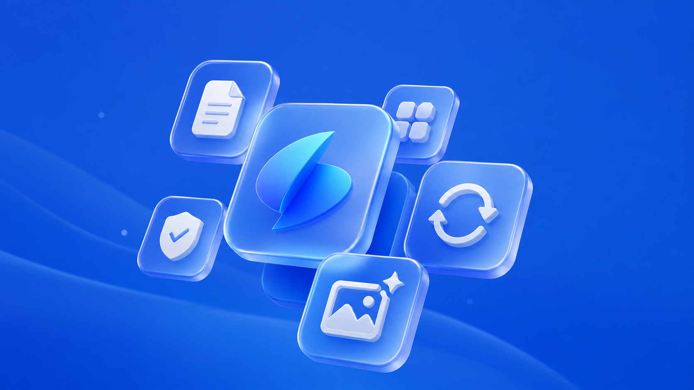

<p align="center">
  
</p>

<h1 align="center">appintoss-kit</h1>

<p align="center">
  <em>An unofficial kit for app-in-toss. Resolve instructions, use skills, verify every loop.</em>
</p>

<p align="center">
  
  
  
  
</p>

<p align="center">
  <sub><a href="./README.md">English</a> &middot; <a href="./README.ko.md">한국어</a></sub>
</p>

---

<p align="center">
  
</p>

`appintoss-kit` is an unofficial agent operating kit for app-in-toss work.
It gives agents a small, repeatable workflow instead of a pile of one-off prompts.
The workflow is simple: read the root contract, resolve the right guide files, load the right local skills, and verify the result before claiming it is ready.

> `AGENTS.md` explains how agents should route work.
> `.agents/` holds the reusable execution layer: skills, hooks, subagents, references, and README assets.

**Resolve the task, apply the skill, make the smallest change, verify with evidence, then move forward.**

## Why this exists

App-in-toss work touches product policy, Korean UX writing, Toss-style visual rules, store assets, screenshots, build output, and console metadata.
Those pieces are easy to mix up when an agent works from memory.
This kit puts the rules where the agent can read them before it acts.

## How it works

| Layer | Role | What it controls |
|---|---|---|
| `AGENTS.md` | Root contract | Working style, instruction inheritance, route resolution |
| `guide/` | Task router | Rules for UI, assets, metadata, policy, and agent files |
| `.agents/skills/` | Execution skills | Naming, SEO keywords, imagegen assets, Toss design theme |
| `.agents/hooks/` | Loop policy | Pre-task resolve, pre-edit gate, post-edit verify, failure replan |
| `.agents/agents/` | Subagents | Adversarial review and delegated checks |
| `.agents/references/` | Local context | Larger reference material loaded only when routed |

## AGENTS.md

`AGENTS.md` is the first file every agent reads.
It establishes the working contract:

- research the codebase before editing
- prefer the smallest correct change
- follow project-level instruction inheritance
- route each task through `guide/resolver.md`
- verify before claiming completion

The important part is routing.
A UI change, asset change, metadata change, and agent-rule change do not use the same checklist.
`AGENTS.md` points agents to the resolver so they load the right rules before editing.

## .agents

`.agents/` is the reusable agent runtime layer.

```text
.agents/
  agents/       # delegated reviewer definitions
  assets/       # README and agent documentation images
  hooks/        # lifecycle gates for the development loop
  references/   # large local references
  skills/       # native skills, each with SKILL.md
```

The skill layer keeps repeated work explicit.
App creation uses naming and SEO skills instead of hand-written guesses.
Asset work uses the imagegen and Toss design theme skills.
Agent-rule work must pass link, path, and behavior-rule checks.

## Loop

The kit expects the same loop for every meaningful task:

```text
resolve
-> read required rules
-> make the smallest scoped change
-> verify with the strictest relevant gate
-> if verification fails, replan from the root cause
-> rerun evidence before completion
```

That loop keeps agent output from drifting into unsupported features, unverified claims, or submission copy that no longer matches the product.

## Repository surface

The repository intentionally tracks only the public coordination layer for the final kit:

```text
.agents/
.claude/
.gitignore
.june-2026-vibe-contest/
AGENTS.md
CLAUDE.md
guide/
LICENSE
README.md
README.ko.md
```

Generated mini-apps, local build output, screenshots, posters, temporary workspaces, and submission bundles stay local unless the ignore rules are changed intentionally.

## For agents

Start here:

```bash
cat AGENTS.md
```

Then resolve the task route:

```bash
cat guide/resolver.md
```

Use local skills when the resolved route calls for them:

```text
.agents/skills/app-naming/
.agents/skills/app-seo-keywords/
.agents/skills/codex-imagegen/
.agents/skills/toss-design-theme/
```

## Policy

This is an unofficial kit for app-in-toss.
Mini-app ideas, generated assets, and submission copy must stay within Apps in Toss policy and the local Toss design rules.
Do not use official Toss marks as the kit or app identity.
Do not invent unsupported behavior.
Do not claim readiness without fresh verification evidence.

## License

MIT
